# 线程&&进程
进程：是指一个内存中运行的应用程序，每个进程都有一个独立的内存空间

线程：是进程中的一个执行路径，共享一个内存空间，线程之间可以自由切换，并发执行. 一个进程最少
有一个线程线程实际上是在进程基础之上的进一步划分，一个进程启动之后，里面的若干执行路径又可以划分
成若干个线程

# 线程调度
分时调度
- 所有线程轮流使用 CPU 的使用权，平均分配每个线程占用 CPU 的时间。
抢占式调度
- 优先让优先级高的线程使用 CPU，如果线程的优先级相同，那么会随机选择一个(线程随机性)，
Java使用的为抢占式调度。
- CPU使用抢占式调度模式在多个线程间进行着高速的切换。对于CPU的一个核新而言，某个时刻，
只能执行一个线程，而CPU的在多个线程间切换速度相对我们的感觉要快，看上去就是 在同一时
刻运行。 其实，多线程程序并不能提高程序的运行速度，但能够提高程序运行效率，让CPU的 使
用率更高。

# 同步与异步
- 同步:排队执行 , 效率低但是安全.
- 异步:同时执行 , 效率高但是数据不安全

# 并发与并行
- 并发：指两个或多个事件在**同一个时间段**内发生。
- 并行：指两个或多个事件在**同一时刻**发生（同时发生）。

# 实操 继承Thread
```java
public class MyThread extends Thread{  //继承Thread
    /**
     * run方法就是线程要执行的任务方法
     */
    @Override
    public void run() {
        //这里的代码就是一条新的执行路径．
        //这个执行路径的处罚方式，不是调用run方法 ﹒而是通过thread对象的start()来启动任务
        for (int i=0;i<5;i++){
            System.out.println("子线程==锄禾日当午+"+i);
        }
    }
}
```
```java
public class Demo {
    public static void main(String[] args) {
        /**
         * 多线程技术
         */
        MyThread m = new MyThread();
        m.start();
        for (int i=0;i<5;i++){
            System.out.println("主线程++汗滴禾下土+"+i);
        }

    }
}
```
执行完会随机出现这样一种情况，证实了在Java里JVM使用的是抢占式调度。
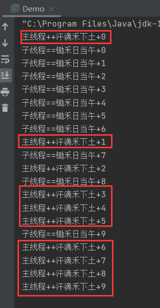
脑洞图

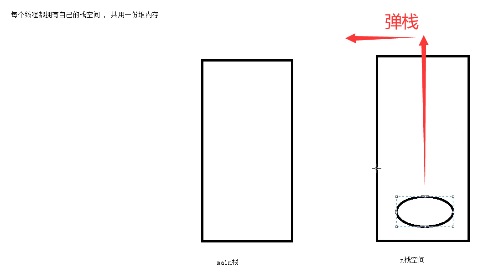

# 实操 实现Runnable
先创建 MyRunnable 类
```java
/**
 * 用于给线程进行执行的任务
 */
public class MyRunnable implements Runnable{
    @Override
    public void run() {
        //线程任务
        for (int i=0;i<10;i++){
            System.out.println("子线程---床前明月光"+i);
        }
    }
}
```
再写一下 main
```java
public class Demo {
    public static void main(String[] args) {
        /**
         * 多线程技术-1-thread
         */
        /*MyThread m = new MyThread();
        m.start();
        for (int i=0;i<10;i++){
            System.out.println("主线程++汗滴禾下土+"+i);
        }*/

        
        //1.    创建一个任务对象
        MyRunnable r = new MyRunnable();
        //2.    创建一个线程，并为其分配一个任务
        Thread t = new Thread(r);
        //3.    执行这个线程
        t.start();
        for (int i=0;i<10;i++){
            System.out.println("主线程---疑是地上霜"+i);
        }

    }
}
```
运行一下
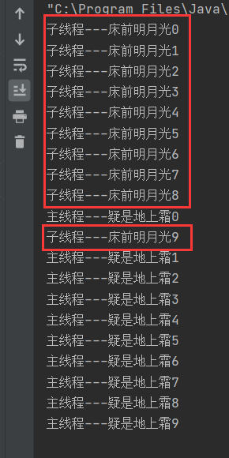

>bezingga： 评价一下上面两种创建线程的方法
> /**
         * 多线程技术-2- runnable
         * 实现Runnable 与继承Thread相比有如下优势:Ⅰ
         * 1.通过创建任务，然后给线程分配的方式来实现的多线程．更适合多个线程同时执行相同任务的情况.2.可以避免单继承所带来的局限性.
         * 3．任务与线程本身是分离的，提高了程序的健壮性.
         * 4．后续学习的线程池技术，接受Runnable类型的任务，不接收Thread类型的线程..
*/
>比较了一下好像 Runnable 比较好 但是 Thread 还有另一种比较简单创建线程的方法
新建 Demo2
```java
public class Demo2 {
    public static void main(String[] args) {
        //匿名内部类实现线程
        //不过也是Thread
        new Thread(){
            @Override
            public void run() {
                for (int i=0;i<10;i++){
                    System.out.println("子线程---一二三四五"+i);
                }
            }
        }.start();
        for (int i=0;i<10;i++){
            System.out.println("主0线程---六七八九十"+i);
        }
    }
}
```
运行结果：也是抢占式调度。
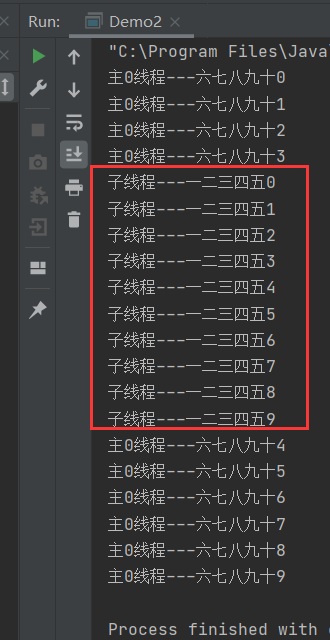

# Thread类
API  构造方法

- Thread() : 创建一个空任务线程
- Thread(Runnable target)   ： 指定任务
  Thread(Runnable target,String name) ：传递任务名称
  Thread(String name) ： 单独传名称
  
普通方法：
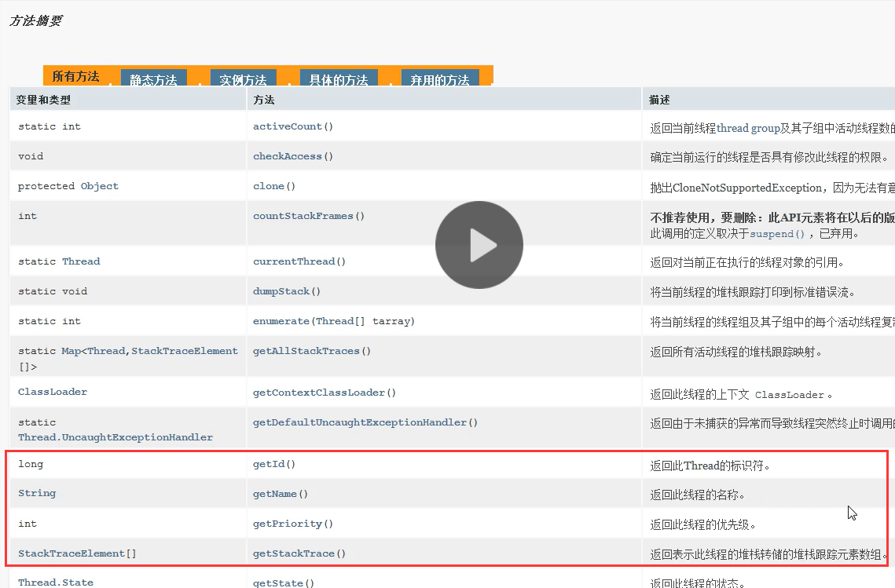
优先级

控制线程抢到时间片的几率
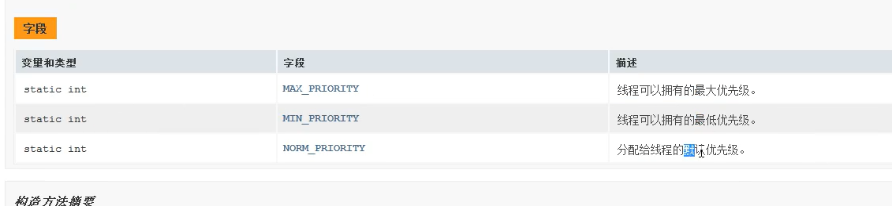
线程停止：通知线程应该死了，让线程自杀  stop不好，过时了，stop可能会让一个文件一直在占用
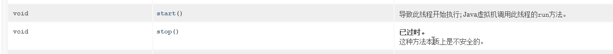
休眠：方法重载
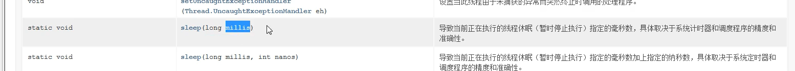
守护线程（游戏玩家） 用户线程（塔） ： 人在塔在
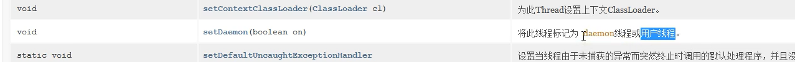

# 设置和获取线程名称
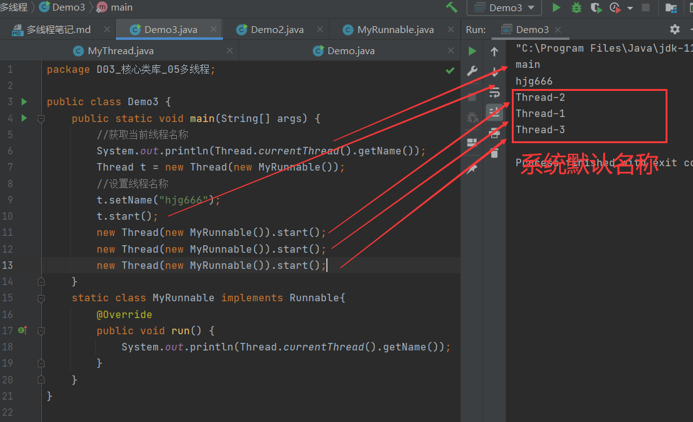

# 线程休眠sleep
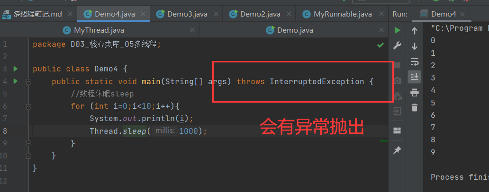

# 线程阻塞
读文件....  耗时操作

# 线程的中断 Demo6
```java
public class Demo6 {
    public static void main(String[] args) {
        //线程的中断
        //一个线程是一个独立的执行路径，它是否应该结束，应该由其自身决定  有生命
        Thread t1 = new Thread(new MyRunnable());
        t1.start();
        for (int i=0;i<5;i++){
            System.out.println(Thread.currentThread().getName()+":"+i);
            try {
                Thread.sleep(1000);
            } catch (InterruptedException e) {
                e.printStackTrace();
            }
        }
        //给t1 添加中断标记
        t1.interrupt();


    }

    static class MyRunnable implements Runnable{
        @Override
        public void run() {
            for (int i=0;i<10;i++){
                System.out.println(Thread.currentThread().getName()+":"+i);
                try {
                    Thread.sleep(1000);
                } catch (InterruptedException e) {
//                    e.printStackTrace();
                    //打标记进入 catch 块 交代处理后事 然后自杀；；；；；；
//                    System.out.println("没事，让我多活一会儿.....");
                    System.out.println("好的，我si了");
                    return;
                }
            }
        }
    }
}
```
触发中断的事件
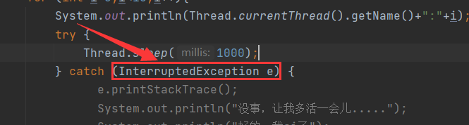
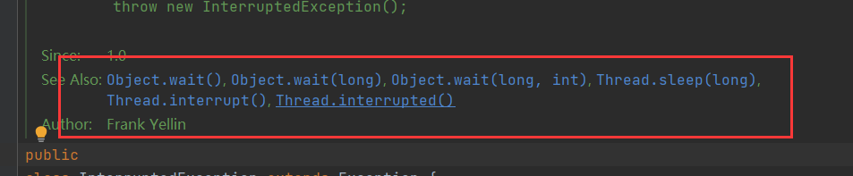

# 守护线程
//线程:分为守护线程和用户线程
//用户线程:当一个进程不包含任何的存活的用户线程时，进行结束．
//守护线程:守护用户线程的，当最后一个用户线程结束时，所有守护线程自动死亡，
//设置t1 为守护线程
t1.setDaemon(true);
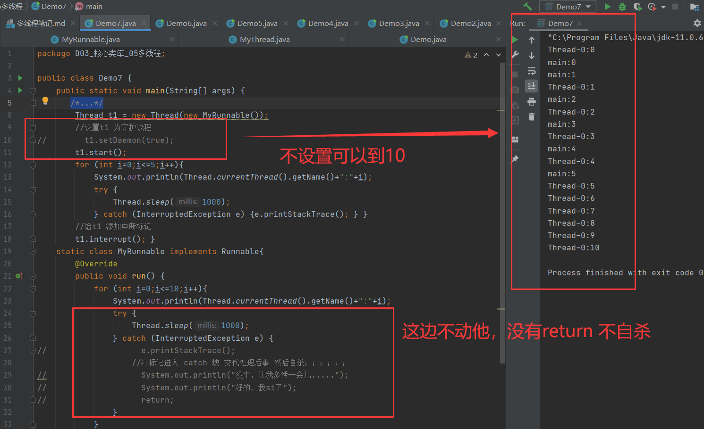!
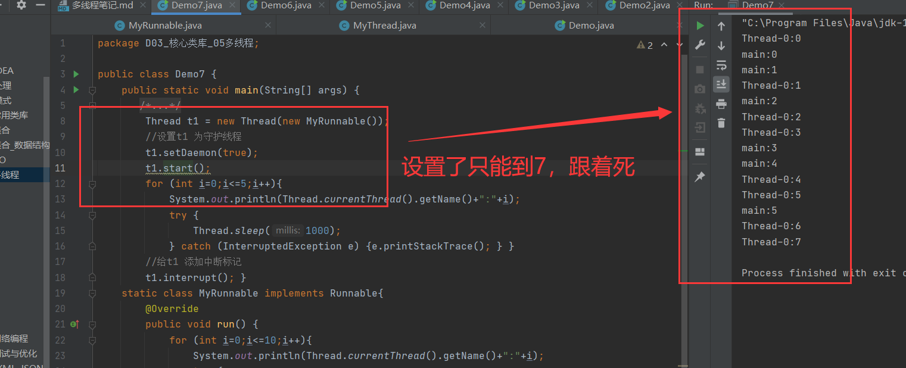

# 线程安全问题
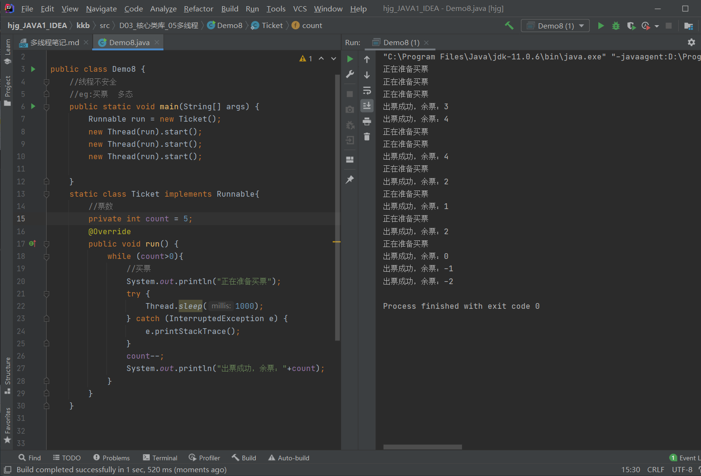

时间片问题
飞机票多卖10%

# 线程安全1-同步代码块
D8-1
# 线程安全2-同步方法

# 线程安全3-显式锁Lock

ps:显式锁 VS 隐式锁

# 公平锁与非公平锁
D8-4
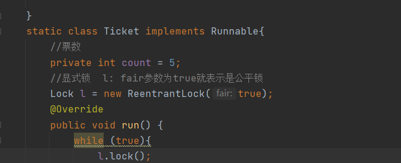

# 线程死锁
警察 VS 罪犯

# 多线程通信问题
# 生产者与消费者
Demoo10

# 线程的六种状态
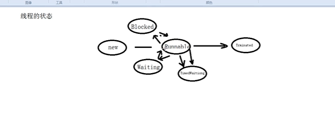
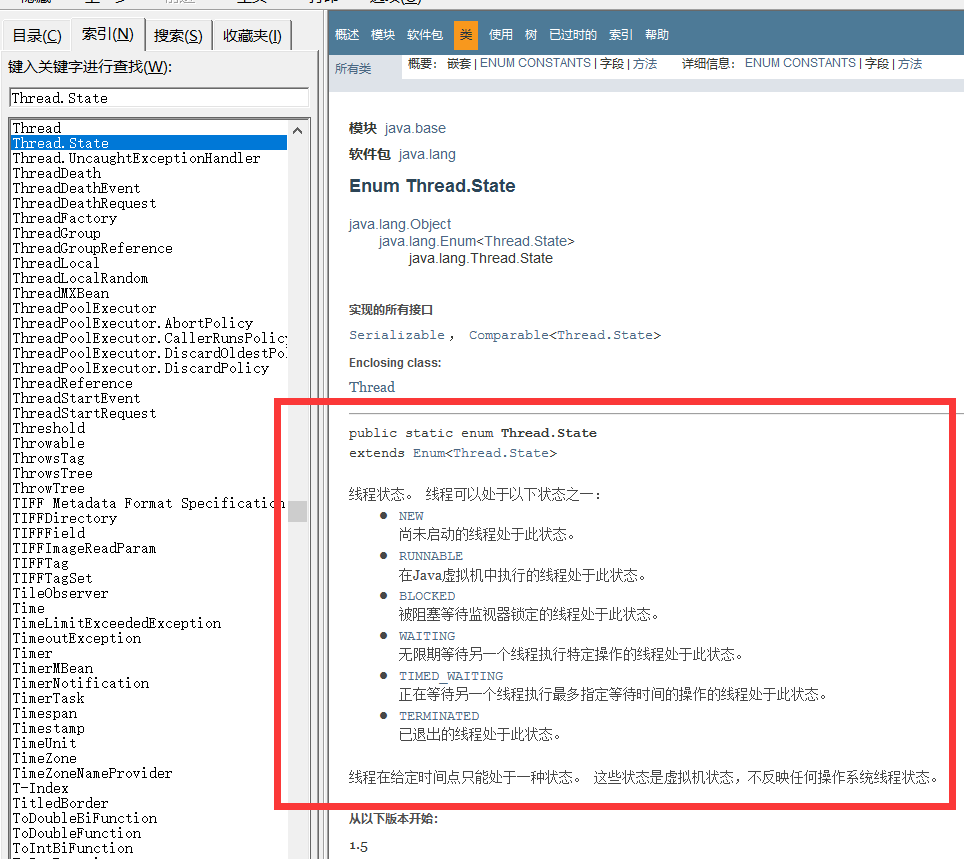

# 带返回值的线程 Callable
三个步骤
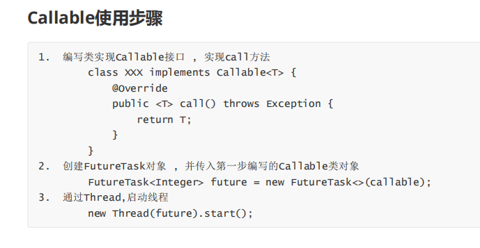
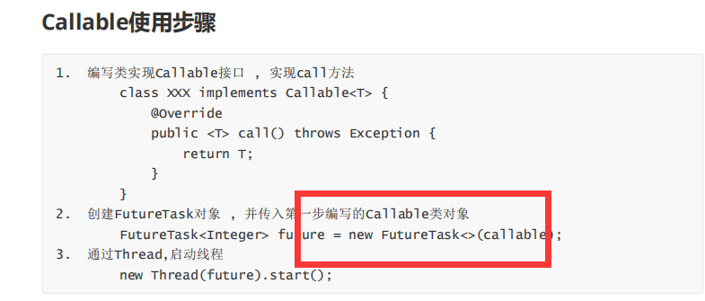
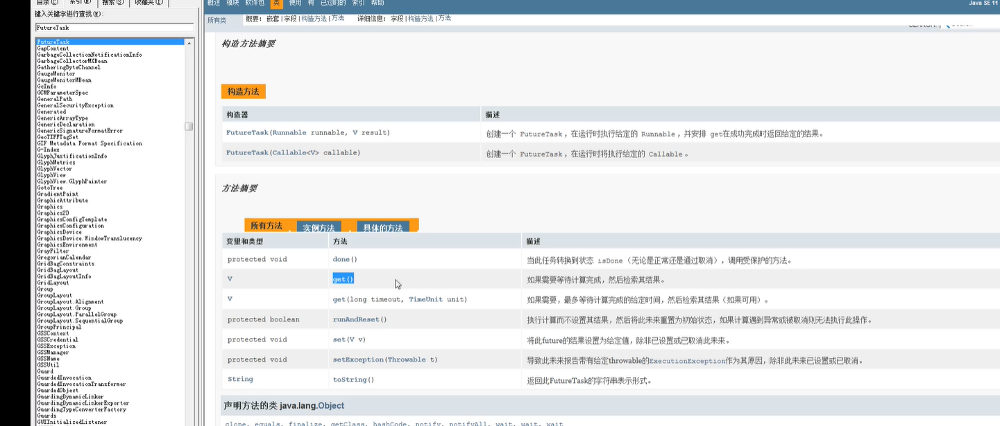


# 线程池概述


1. 缓存线程池
   
2. 定长线程池
   
3. 单线程线程池
   
4. 周期性任务定长线程池


# Lambda表达式
Demoo17
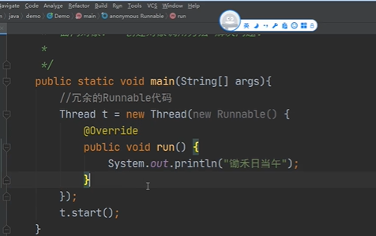
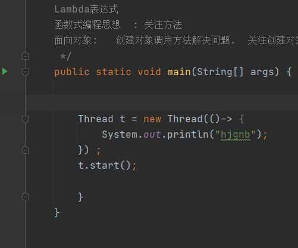
Demoo17_1
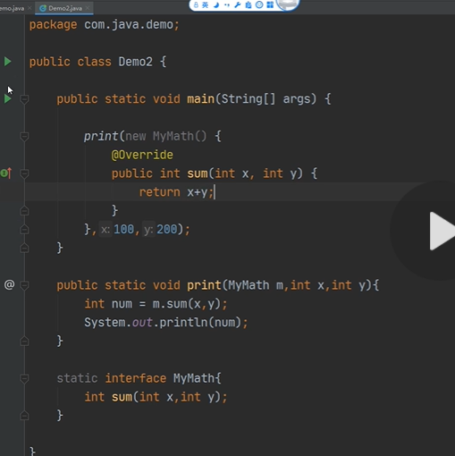


