# Collection 集合
><u>其实早在 Java1.0 版本时，Java 中就内置了大量的数据结构类，后面又整理成了集合体系（如下图）</u> 
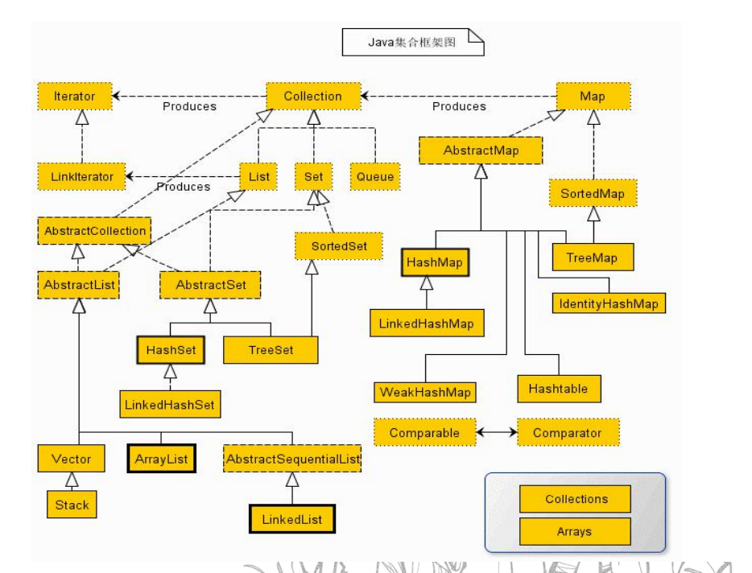

# 1.1 集合概述
- 集合：集合是java中提供的一种容器，可以用来存储多个数据。
- 集合和数组既然都是容器，它们有啥区别呢？
- - 数组的长度是固定的。集合的长度是可变的。
- - 数组中存储的是同一类型的元素，可以存储基本数据类型值。集合存储的都是对象。而且对象的类型可以不一致。在开发中一般当对象多的时候，使用集合进行存储。

# 1.2 集合框架
JAVASE提供了满足各种需求的API，在使用这些API前，先了解其继承与接口操作架构，才能了解何时采用哪个类，以及类之间如何彼此合作，从而达到灵活应用。集合按照其存储结构可以分为两大类，分别是
			* 单列集合 java.util.Collection 
			* 双列集合java.util.Map 
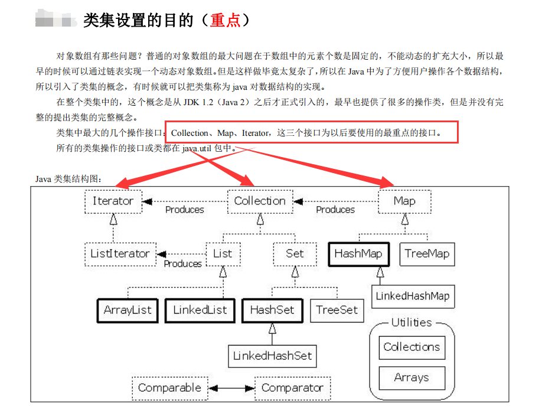
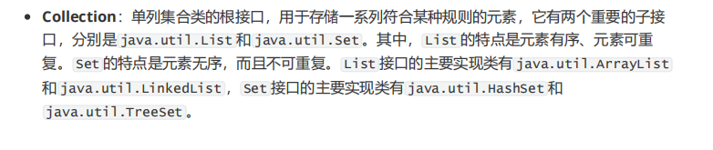
此接口使用了泛型技术，在 JDK 1.5 之后为了使类集操作的更加安全，所以引入了泛型。
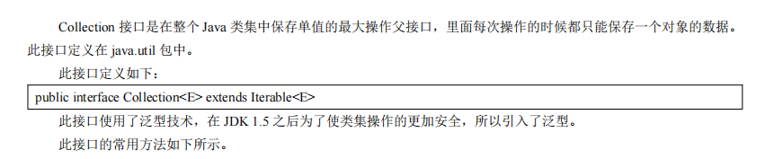
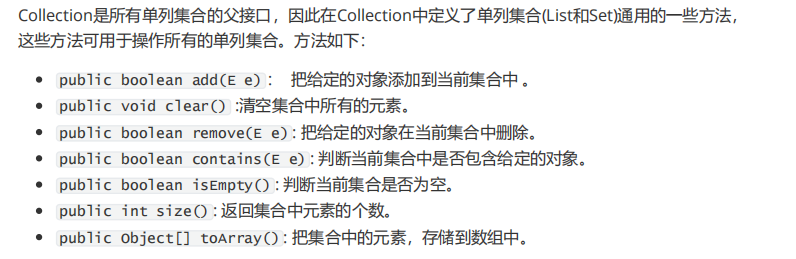
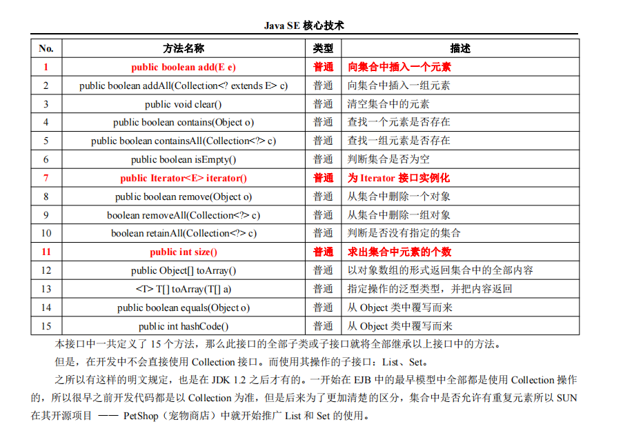

# 2. List集合
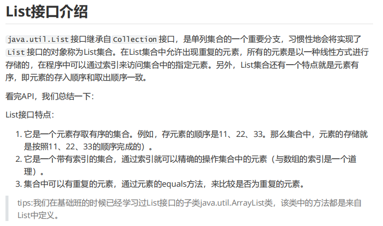
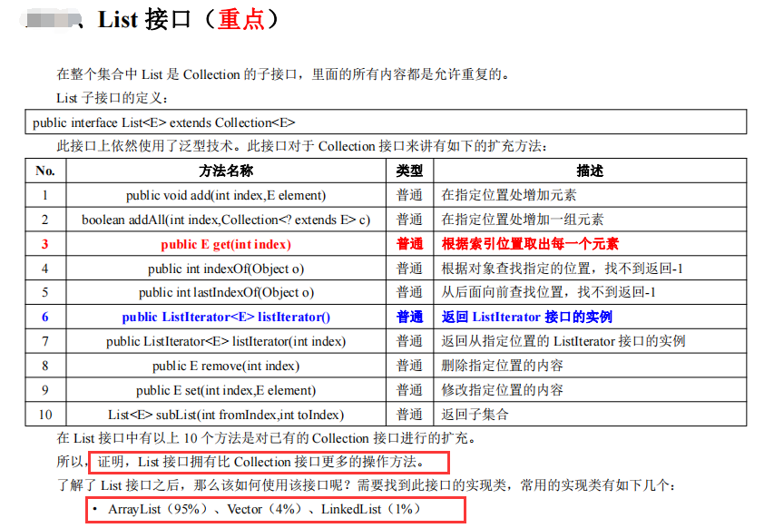

List接口中常用方法
List作为Collection集合的子接口，不但继承了Collection接口中的全部方法，而且还增加了一些根据元
素索引来操作集合的特有方法，如下：
- public void add(int index, E element) : 将指定的元素，添加到该集合中的指定位置上。
- public E get(int index) :返回集合中指定位置的元素。
- public E remove(int index) : 移除列表中指定位置的元素, 返回的是被移除的元素。
- public E set(int index, E element) :用指定元素替换集合中指定位置的元素,返回值的更新
前的元素。

## 2.0 List的子类
## 2.1 ArrayList 集合 (使用率 95%)
`java.util.ArrayList` 集合数据存储的结构是数组结构。元素增删慢，查找快，由于日常开发中使用
最多的功能为查询数据、遍历数据，所以 ArrayList 是最常用的集合。 许多程序员开发时非常随意地使用ArrayList完成任何需求，并不严谨，这种用法是不提倡的。
ArrayList 是 List 接口的子类，此类的定义如下：

```java
public class ArrayList<E> extends AbstractList<E> 
implements List<E>, RandomAccess, Cloneable, Serializable
```
此类继承了 AbstractList 类。AbstractList 是 List 接口的子类。AbstractList 是个抽象类，适配器设计模式。
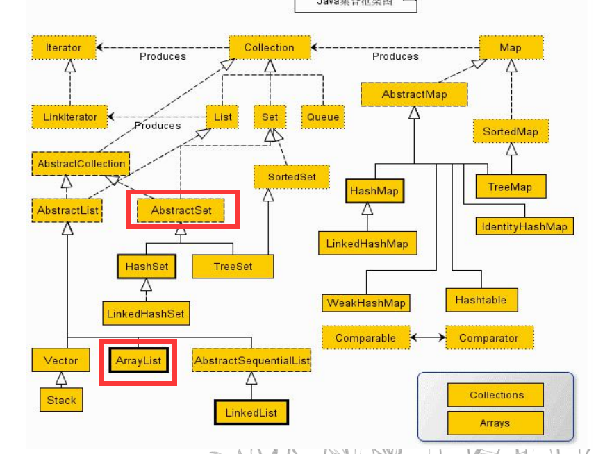
```java
import java.util.ArrayList;
import java.util.List;

public class D01_ArrayList {
    public static void main(String[] args) {
        //ArrayList   :    使用数组结构，对于增加删除慢。查找快
        ArrayList<Integer> data = new ArrayList<>();
        data.add(100);
        data.add(22);
        System.out.println(data.get(0));
        
//范例：增加及取得元素
        List<String> all = new ArrayList<String>(); // 实例化List对象，并指定泛型类型
        all.add("hello ");                          // 增加内容，此方法从Collection接口继承而来
        all.add(0, "LAMP ");          // 增加内容，此方法是List接口单独定义的
        all.add(1,"world");           // 增加内容，此方法从Collection接口继承而来
        System.out.println(all);                    // 打印all对象调用toString()方法
    }
}
```
以上的操作向集合中增加了三个元素，其中在指定位置增加的操作是 List 接口单独定义的。随后进行输出的时候， 实际上调用的是 toString()方法完成输出的。 可以发现，此时的对象数组并没有长度的限制，长度可以任意长，只要是内存够大就行。

范例：进一步操作 
· 使用 remove()方法删除若干个元素，并且使用循环的方式输出。 
· 根据指定位置取的内容的方法，**只有 List 接口才有定义**，其他的任何接口都没有任何的定义。
```java
import java.util.ArrayList;
import java.util.List;

public class D02_ArrayList {
    public static void main(String[] args) {
        List<String> all = new ArrayList<String>(); // 实例化List对象，并指定泛型类型
        all.add("hello");   // 增加内容，此方法从Collection接口继承而来
        all.add(0,"Lamp");  // 增加内容，此方法是List接口单独定义的
        all.add("world");
        System.out.println(all);    // 打印all对象调用toString()方法

        all.remove(1); // 根据索引删除内容，此方法是List接口单独定义的
        all.remove("world"); // 删除指定的对象
        System.out.print("List 集合中的内容是：");
        for (int x = 0;x < all.size();x++){
            System.out.println(all.get(x) + " 、");
        }
    }
}
```
## 2.2 Vector（使用率 4%）
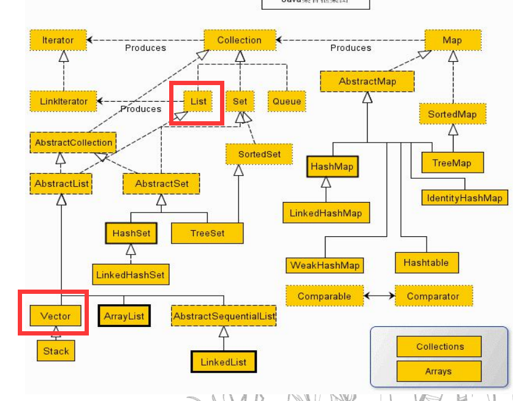
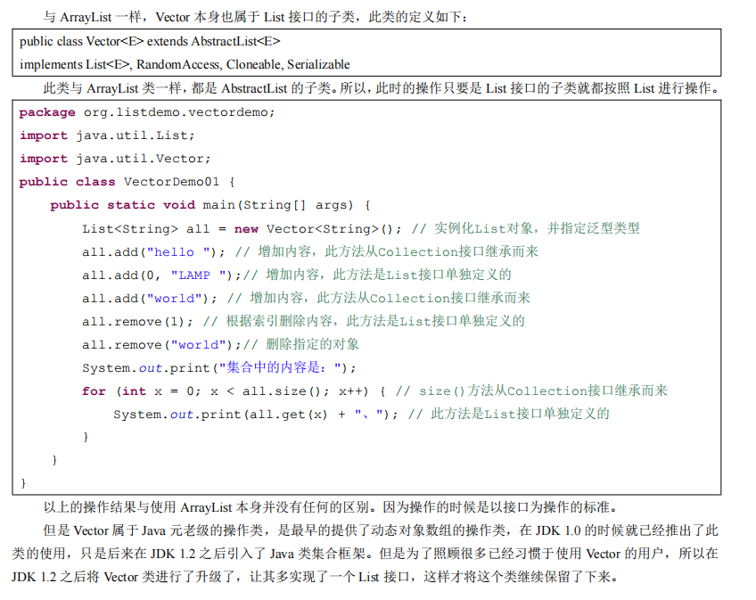
## Vector 类和 ArrayList 类的区别（重点）
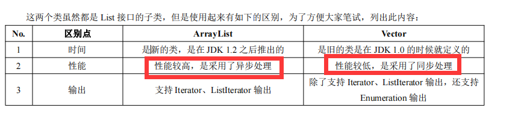
## 2.3 LinkedList 集合 (使用率 1%)   ----链表操作类
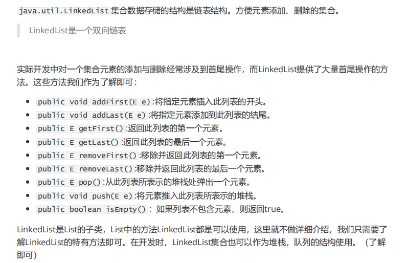
此类的使用几率是非常低的，但是此类的定义如下： 

public class LinkedList<E> extends AbstractSequentialList<E> 
implements List<E>, Deque<E>, Cloneable, Serializable

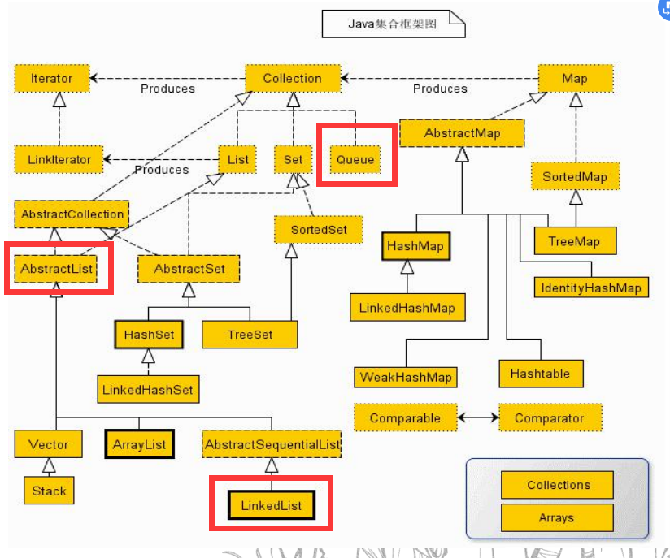
此类继承了 AbstractList，所以是 List 的子类。但是此类也是 Queue 接口的子类，Queue 接口定义了如下的方法：
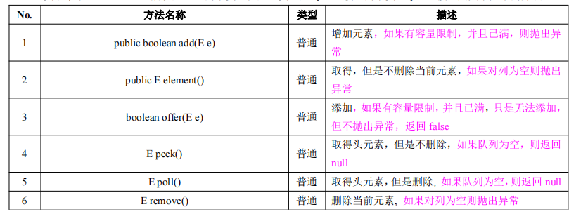
```java
import java.util.LinkedList;

public class D03_LinkedList  {
    public static void main(String[] args) {
        //LinkedList : 使用的是双向链表结构，对于增加删除快，查找慢
        //栈 队列 单端 双端  业务需求
        //add   remove  get
        LinkedList<Integer> data = new LinkedList<>();
//        data.addFirst(100);
//        data.addFirst(200);
//        Integer i = data.removeFirst();
//        System.out.println(i);

        //；压栈
        data.push(123);
        data.push(456);
        //弹栈
        Integer o = data.pop();
        System.out.println(o);
    }
}
```
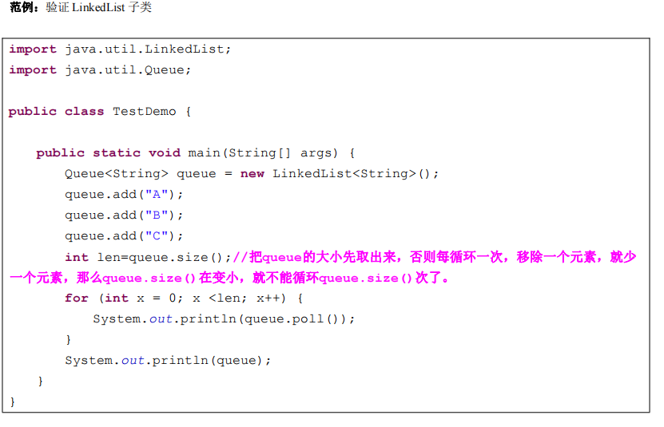

## 2.4 Iterator 迭代器
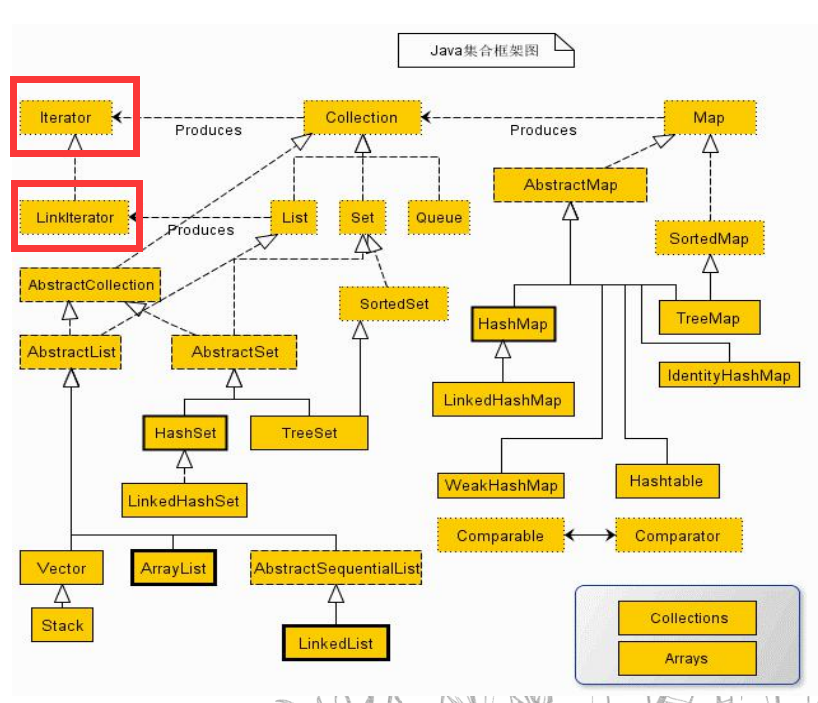
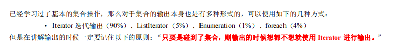
### 2.4.1 Iterator 接口
在程序开发中，经常需要遍历集合中的所有元素。针对这种需求，JDK专门提供了一个接口
`java.util.Iterator` 。 `Iterator` 接口也是Java集合中的一员，但它与 `Collection` 、 `Map` 接口有所 不同， 
`Collection` 接口与 `Map` 接口主要用于**存储元素**，而 `Iterator` 主要用于**迭代访问（即遍历） Collection 中的元素**，
因此 Iterator 对象也被称为迭代器。 想要遍历Collection集合，那么就要获取该集合迭代器完成迭代操作，下面介绍一下获取迭代器的方 法：
`public Iterator iterator()` : 获取集合对应的迭代器，用来遍历集合中的元素的。
下面介绍一下迭代的概念：
迭代：即Collection集合元素的通用获取方式。在取元素之前先要判断集合中有没有元素，如果有，就把这个元素取出来，继续在判断，如果还有就再取出出来。一直把集合中的所有元素全部取
出。这种取出方式专业术语称为`迭代`。 
Iterator接口的常用方法如下：
public E next() :返回迭代的下一个元素。
public boolean hasNext() :如果仍有元素可以迭代，则返回 true。
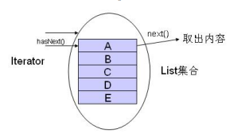

迭代器的实现原理
我们在之前案例已经完成了`Iterator`遍历集合的整个过程。当遍历集合时，首先通过调用t集合的 iterator()方法获得迭代器对象，然后使用hashNext()方法判断集合中是否存在下一个元素，如果存在，
则调用next()方法将元素取出，否则说明已到达了集合末尾，停止遍历元素。
```java
import java.util.ArrayList;
import java.util.Collection;
import java.util.Iterator;

//Iterator与ListIterator
public class D04_Iterator_ {
    public static void main(String[] args) {
        Collection<String> all = new ArrayList<String>();
        all.add("A"); all.add("B"); all.add("C"); all.add("D"); all.add("E");
        Iterator<String> iter = all.iterator();
        while (iter.hasNext()) {
            // 判断是否有下一个元素
            String str = iter.next();
            // 取出当前元素
            System.out.print(str + "、");
        }
    }
}
```
以上的操作是 Iterator 接口使用最多的形式，也是一个标准的输出形式。 但是在使用 Iterator 输出的时候有一点必须注意，在进行迭代输出的时候如果要想删除当前元素，则只能使用 Iterator 接口中的 remove()方法，而不能使用集合中的 remove()方法。否则将出现未知的错误。
```java
import java.util.ArrayList;
import java.util.Collection;
import java.util.Iterator;

public class D05_Iterator_ {
    public static void main(String[] args) {
        Collection<String> all = new ArrayList<String>();
        all.add("A"); all.add("B");
        all.add("C"); all.add("D");
        all.add("E");
        Iterator<String> iter = all.iterator();
        while (iter.hasNext()) {
            // 判断是否有下一个元素
            String str = iter.next();
            // 取出当前元素
            if (str.equals("C")) {
                all.remove(str); // 错误的，调用了集合中的删除
            } else { 
                System.out.print(str + "、");
            }
        }
    }
}
```
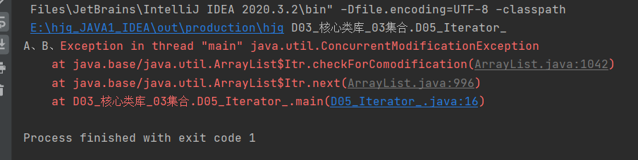
但是，从实际的开发角度看，元素的删除操作出现的几率是很小的，基本上可以忽略，即：集合中很少有删除元素 的操作。Iterator 接口本身可以完成输出的功能，但是此接口只能进行由前向后的单向输出。如果要想进行双向输出，则必须 使用其子接口 —— `ListIterator`。
### 2.4.2 ListIterator（理解）
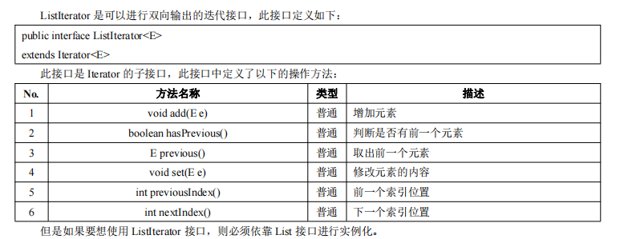
List 接口中定义了以下的方法：ListIterator<E> listIterator()
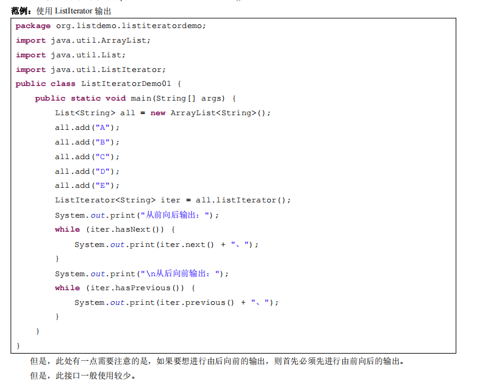


### 2.4.3 废弃的接口：Enumeration（了解）
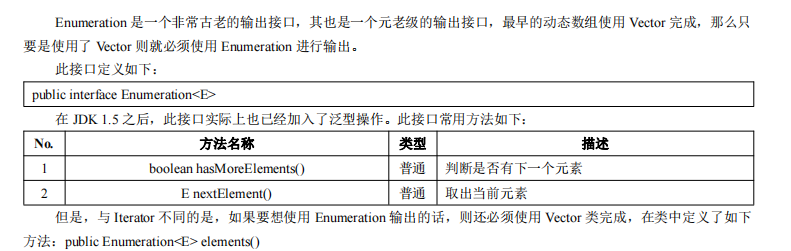
```java
import java.util.Enumeration;
import java.util.Vector;

public class D05_E {
    public static void main(String[] args) {
        Vector<String> v = new Vector<String>();
        v.add("A");
        v.add("B");
        v.add("C");
        Enumeration<String> enu = v.elements();
        while (enu.hasMoreElements()) {
            System.out.println(enu.nextElement());
        }
    }
}
```
需要注意的是，在大部分的情况下，此接口都不再使用了，但是对于一些古老的类库，本身依然要使用此接口进行 操作，所以此接口一定要掌握。 所有的代码最好可以用记事本独立写出


### 2.4.4 增强for
增强for循环(也称for each循环)是JDK1.5以后出来的一个高级for循环，专门用来遍历数组和集合的。它的内部原理其实是个Iterator迭代器，所以在遍历的过程中，不能对集合中的元素进行增删操作。
格式：
```
for(元素的数据类型 变量 : Collection集合or数组){ //写操作代码 }
```
它用于遍历 `Collection` 和 `数组` 。通常只进行遍历元素，**不要在遍历的过程中对集合元素进行增删操作**。

**练习1：遍历数组**
```java
public class D05_forEach {
    //forEach   : 增强For 循环  最早在C#中
    // 用于迭代数组 或 集合
    public static void main(String[] args) {
        int[] arr = {6,5,4,3,2,1};
        //使用增强for遍历数组
        for(int a : arr){
            //a代表数组中的每个元素
            System.out.print(a);
        }
    }
}
```
**练习2:遍历集合**
```java
public class NBFor { 
    public static void main(String[] args) { 
        Collection<String> coll = new ArrayList<String>(); 
        coll.add("锄禾日当午"); 
        coll.add("汗滴禾下土"); 
        coll.add("谁知盘中餐"); 
        coll.add("粒粒皆辛苦"); 
        //使用增强for遍历 
		for(String s :coll){
		    //接收变量s代表 代表被遍历到的集合元素 
			System.out.println(s); 
		} 
    } 
}
```
tips: 新for循环必须有被遍历的目标。目标只能是Collection或者是数组。新式for仅仅作为遍历操作出现。
在使用 foreach 输出的时候一定要注意的是，里面的操作泛型要指定具体的类型，这样在输出的时候才会更加有针对 性。

# 3. Set接口
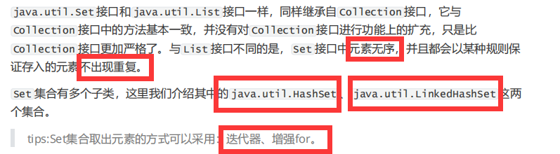
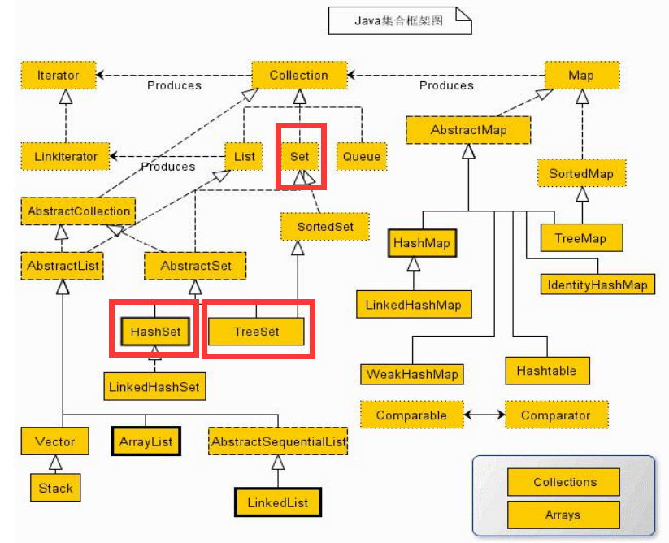
Set 接口也是 Collection 的子接口，与 List 接口最大的不同在于，Set 接口里面的内容是不允许重复的。 Set 接口并没有对 Collection 接口进行扩充，基本上还是与 Collection 接口保持一致。因为此接口没有 List 接口中定义 的 get(int index)方法，所以**无法使用循环进行输出。**
既然 Set 接口并没有扩充任何的 Collection 接口中的内容，所以使用的方法全部都是 Collection 接口定义而来的。
## 3.1 HashSet集合介绍

我们先来使用一下Set集合存储，看下现象，再进行原理的讲解:
```java
import java.util.HashSet;
import java.util.Set;

public class D06_Set {
	public static void main(String[] args) {
		Set<String> set = new HashSet<String>(); // 实例化Set接口对象
		//添加元素
		set.add(new String("123")); set.add("123"); set.add("123"); set.add("321");
		//遍历
		for (String name : set) { System.out.println(name); }
	}
}
```
输出结果如下，说明 SET 集合中不能存储重复元素：
123 321

java.util.HashSet 是 Set 接口的一个实现类，它所存储的元素是不可重复的，并且元素都是无序的
(即存取顺序不一致)。 java.util.HashSet 底层的实现其实是一个 java.util.HashMap 支持，由于我
们暂时还未学习，先做了解。
HashSet 是根据对象的哈希值来确定元素在集合中的存储位置，因此具有良好的存取和查找性能。保证
元素唯一性的方式依赖于： hashCode 与 equals 方法。

### 3.1.1 HashSet集合存储数据的结构（哈希表）
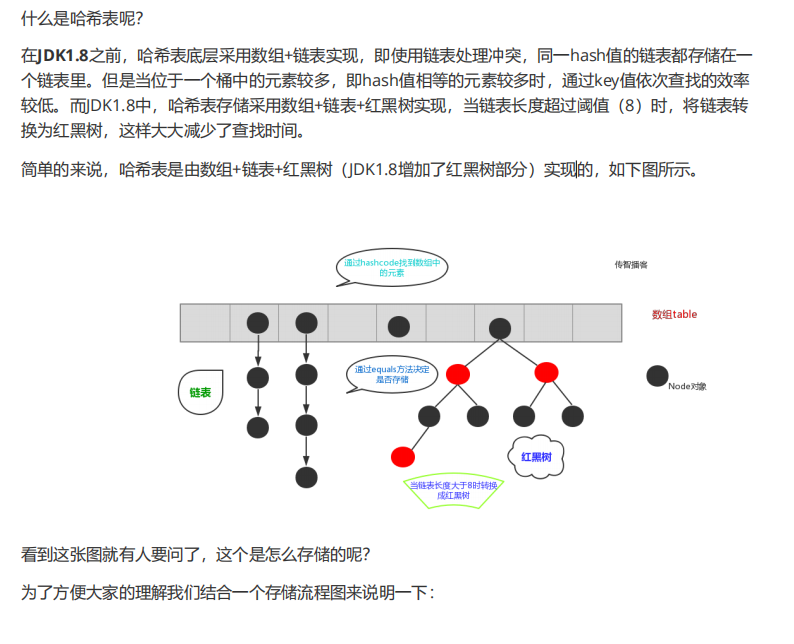
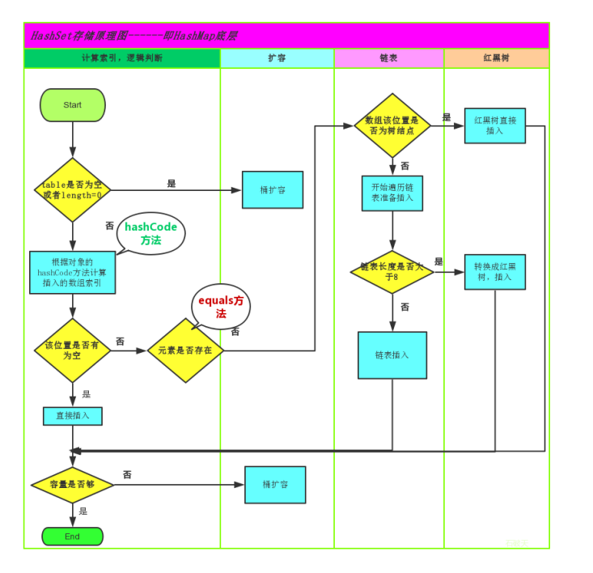
总而言之，JDK1.8引入红黑树大程度优化了HashMap的性能，那么对于我们来讲保证HashSet集合元
素的唯一，其实就是根据对象的hashCode和equals方法来决定的。如果我们往集合中存放自定义的对
象，那么保证其唯一，就必须复写hashCode和equals方法建立属于当前对象的比较方式。

HashSet存储自定义类型元素
给HashSet中存放自定义类型元素时，需要重写对象中的hashCode和equals方法，建立自己的比较方
式，才能保证HashSet集合中的对象唯一
LinkedHashSet
我们知道HashSet保证元素唯一，可是元素存放进去是没有顺序的，那么我们要保证有序，怎么办呢？
在HashSet下面有一个子类 java.util.LinkedHashSet ，它是链表和哈希表组合的一个数据存储结
构。

再来一些代码
范例：观察 HashSet
```java
import java.util.HashSet;
import java.util.Set;

public class D06_set2 {
	public static void main(String[] args) {
		Set<String> all = new HashSet<String>(); // 实例化Set接口对象
		all.add("A"); all.add("B"); all.add("C"); all.add("D"); all.add("E");
		System.out.println(all);
	}
}
```
使用 HashSet 实例化的 Set 接口实例，本身属于无序的存放。 那么，现在思考一下？能不能通过循环的方式将 Set 接口中的内容输出呢？ 是可以实现的，因为在 Collection 接口中定义了将集合变为对象数组进行输出。
```java
import java.util.HashSet;
import java.util.Set;

public class D06_set3 {
	public static void main(String[] args) {
		Set<String> all = new HashSet<String>(); // 实例化Set接口对象
		all.add("A"); all.add("B"); all.add("C"); all.add("D"); all.add("E");
		Object obj[] = all.toArray(); // 将集合变为对象数组
		for (int x = 0; x < obj.length; x++) {
			System.out.print(obj[x] + "、");
		}
	}
}
```
但是，以上的操作不好，因为在操作的时候已经指定了操作的泛型类型，那么现在最好的做法是由泛型所指定的类 型变为指定的数组。 所以只能使用以下的方法：<T> T[] toArray(T[] a)
```java
import java.util.HashSet;
import java.util.Set;

public class D06_set4 {
    public static void main(String[] args) {
        Set<String> all = new HashSet<String>(); // 实例化Set接口对象
        all.add("A"); all.add("B"); all.add("C"); all.add("D"); all.add("E");
        String[] str = all.toArray(new String[] {});// 变为指定的泛型类型数组
        for (int x = 0; x < str.length; x++) {
            System.out.print(str[x] + "、");
        }
    }
}
```
下面再进一步验证 Set 接口中是不能有重复的内容的。
```java
import java.util.HashSet;
import java.util.Set;

public class D06_set5 {
    public static void main(String[] args) {
        Set<String> all = new HashSet<String>(); // 实例化Set接口对象
        all.add("A");
        all.add("A");
        all.add("A");
        all.add("A");
        all.add("A");
        all.add("A");
        all.add("B");
        all.add("C");
        all.add("D");
        all.add("E");
        System.out.println(all);
    }
}
```
以上字符串“A”设置了很多次，因为 Set 接口中是不能有任何的重复元素的，所以其最终结果只能有一个“A”。

## 3.2 排序的子类：TreeSet
与 HashSet 不同的是，TreeSet 本身属于排序的子类，此类的定义如下： 
public class TreeSet<E> extends AbstractSet<E> 
implements NavigableSet<E>, Cloneable, Serializable
```java
import java.util.Set;
import java.util.TreeSet;

public class D08_TreeSet {
    public static void main(String[] args) {
        // 实例化Set接口对象
        Set<String> all = new TreeSet<String>();
        all.add("D");
        all.add("X");
        all.add("A"); 
        System.out.println(all);
    }
}
```
虽然在增加元素的时候属于无序的操作，但是增加之后却可以为用户进行排序功能的实现。

### 3.2.1 排序的说明
既然 Set 接口的 TreeSet 类本身是允许排序，那么现在自定义一个类是否可以进行对象的排序呢？
范例：定义 Person 类
```java
public class D08_TreeSet_Person {
    private String name;
    private int age;

    public D08_TreeSet_Person() {
    }

    public D08_TreeSet_Person(String name, int age) {
        this.name = name;
        this.age = age;
    }

    public String getName() {
        return name;
    }

    public void setName(String name) {
        this.name = name;
    }

    public int getAge() {
        return age;
    }

    public void setAge(int age) {
        this.age = age;
    }
}
```
下面定义一个 TreeSet 集合，向里面增加若干个 Person 对象
```java
import java.util.Set;
import java.util.TreeSet;

public class D08_TreeSet与Comparable {
    public static void main(String[] args) {
        Set<D08_TreeSet_Person> all = new TreeSet<D08_TreeSet_Person>();
        all.add(new D08_TreeSet_Person("张三", 10));
        all.add(new D08_TreeSet_Person("李四", 10));
        all.add(new D08_TreeSet_Person("王五", 11));
        all.add(new D08_TreeSet_Person("赵六", 12));
        all.add(new D08_TreeSet_Person("孙七", 13));
        System.out.println(all);
    }
}
```
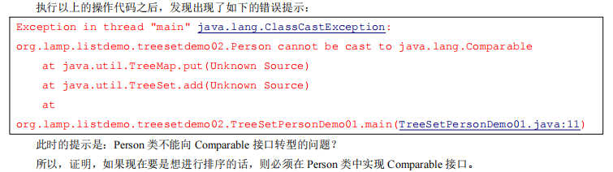
```java
public class D08_TreeSet_Person implements Comparable<D08_TreeSet_Person>{
    private String name;
    private int age;

    @Override
    public int compareTo(D08_TreeSet_Person per) {
        if (this.age > per.age) {
            return 1;
        } else if (this.age < per.age) {
            return -1;
        } else {
            return 0;
        }
    }

    public D08_TreeSet_Person() {
    }

    public D08_TreeSet_Person(String name, int age) {
        this.name = name;
        this.age = age;
    }

    public String getName() {
        return name;
    }

    public void setName(String name) {
        this.name = name;
    }

    public int getAge() {
        return age;
    }

    public void setAge(int age) {
        this.age = age;
    }

    @Override
    public String toString() {
         return "姓名：" + this.name + "，年龄：" + this.age;
    }
}
```
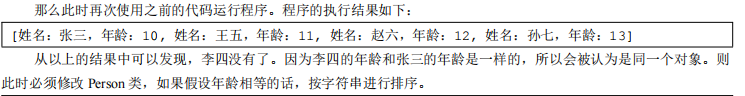
```java
@Override
    public int compareTo(D08_TreeSet_Person per) {
        if (this.age > per.age) {
            return 1;
        } else if (this.age < per.age) {
            return -1;
        } else {
            return this.name.compareTo(per.name);
        }
    }
```
此时，可以发现李四出现了，如果加入了同一个人的信息的话，则会认为是重复元素，所以无法继续加入。

### 3.2.2 关于重复元素的说明

之前使用 Comparable 完成的对于重复元素的判断，那么 Set 接口定义的时候**本身就是不允许重复元素的**，那么证明 如果现在真的是有重复元素的话，使用 HashSet 也同样可以进行区分。
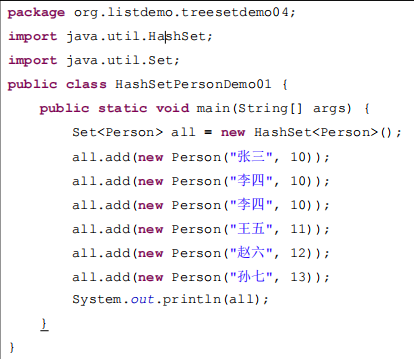
此时发现，并没有去掉所谓的重复元素，也就是说之前的操作并不是真正的重复元素的判断，而是通过 Comparable 接口间接完成的。 
如果要想判断两个对象是否相等，则必须使用 Object 类中的 equals()方法。 
从最正规的来讲，如果要想判断两个对象是否相等，则有两种方法可以完成： 
· 第一种判断两个对象的编码是否一致，这个方法需要通过 hashCode()完成，即：每个对象有唯一的编码 
· 还需要进一步验证对象中的每个属性是否相等，需要通过 equals()完成。 所以此时需要覆写 Object 类中的 hashCode()方法，此方法表示一个唯一的编码，一般是通过公式计算出来的。

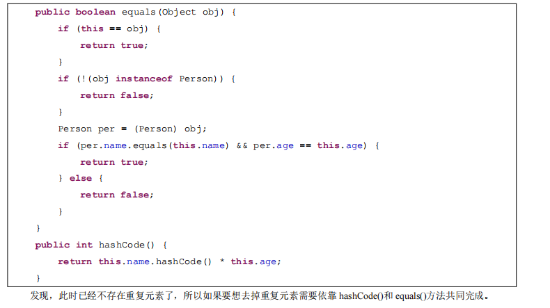

##  小结：
关于 TreeSet 的排序实现，如果是集合中对象是自定义的或者说其他系统定义的类没有实现 Comparable 接口，则不能实现 TreeSet 的排序，会报类型转换（转向 Comparable 接口）错误。 换句话说要添加到 TreeSet 集合中的对象的类型必须实现了 Comparable 接口。 
不过 TreeSet 的集合因为借用了 Comparable 接口，同时可以去除重复值，而 HashSet 虽然是 Set 接口子类，但是对于没有复写 Object 的 equals 和 hashCode 方法的对象，加入了 HashSet 集合中也是不能去掉重复值的。

### 在加一个 Collections
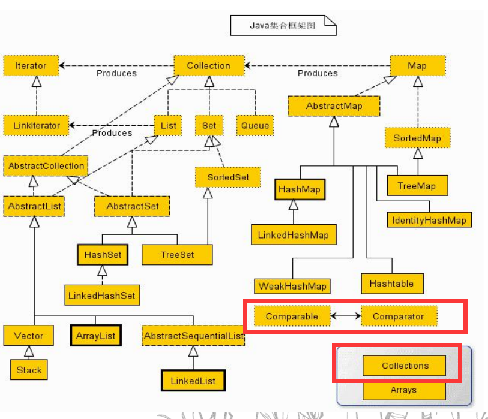
Collections 实际上是一个集合的操作类，此类的定义如下： public class Collections extends Object 这个类与 Collection 接口没有任何的关系。**是一个单独存在的类**
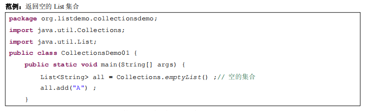
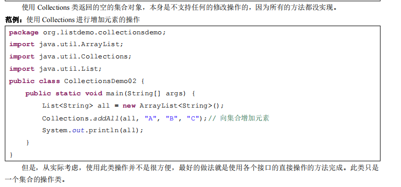
常用功能
java.utils.Collections 是集合工具类，用来对集合进行操作。部分方法如下：
public static <T> boolean addAll(Collection<T> c, T... elements) :往集合中添加一 些元素。
public static void shuffle(List<?> list) 打乱顺序 :打乱集合顺序。
public static <T> void sort(List<T> list) :将集合中元素按照默认规则排序。
public static <T> void sort(List<T> list，Comparator<? super T> ) :将集合中元素按 照指定规则排序。
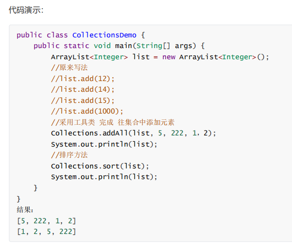
代码演示之后 ，发现我们的集合按照顺序进行了排列，可是这样的顺序是采用默认的顺序，如果想要指
定顺序那该怎么办呢？
我们发现还有个方法没有讲， public static <T> void sort(List<T> list，Comparator<? super T> ) :将集合中元素按照指定规则排序。接下来讲解一下指定规则的排列。
### Comparator比较器
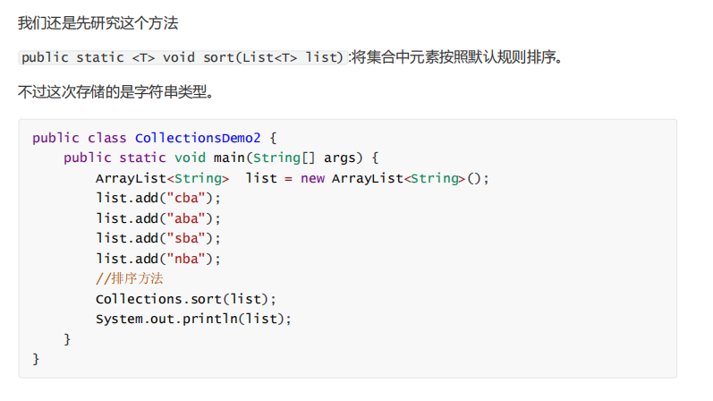
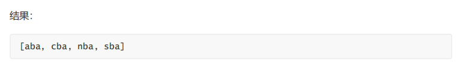
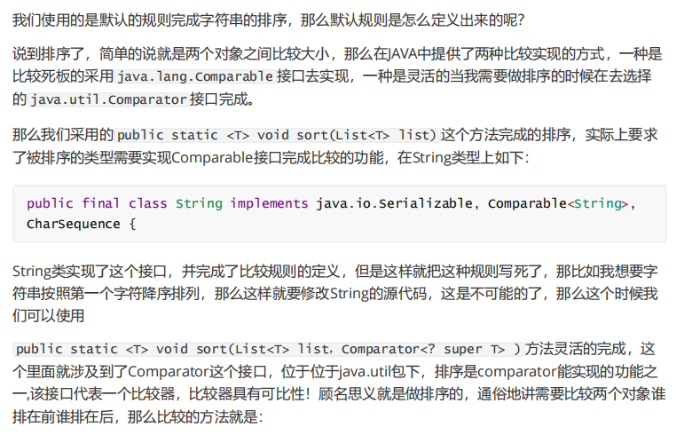
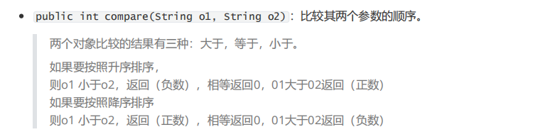
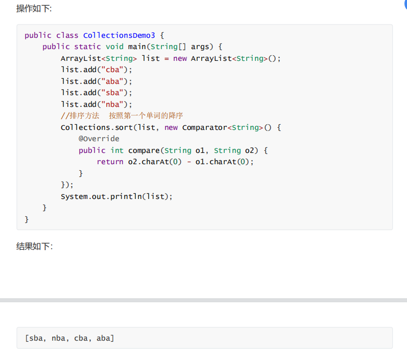

## 简述Comparable和Comparator两个接口的区别。
**Comparable**：强行对实现它的每个类的对象进行整体排序。这种排序被称为类的自然排序，类的 compareTo方法被称为它的自然比较方法。只能在类中实现compareTo()一次，不能经常修改类的代码 实现自己想要的排序。实现此接口的对象列表（和数组）可以通过Collections.sort（和Arrays.sort）进 行自动排序，对象可以用作有序映射中的键或有序集合中的元素，无需指定比较器。
**Comparator** 强行对某个对象进行整体排序。可以将Comparator 传递给sort方法（如Collections.sort 或 Arrays.sort），从而允许在排序顺序上实现精确控制。还可以使用Comparator来控制某些数据结构 （如有序set或有序映射）的顺序，或者为那些没有自然顺序的对象collection提供排序。
练习
创建一个学生类，存储到ArrayList集合中完成指定排序操作。
Student 初始类
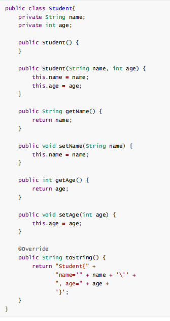
测试类：
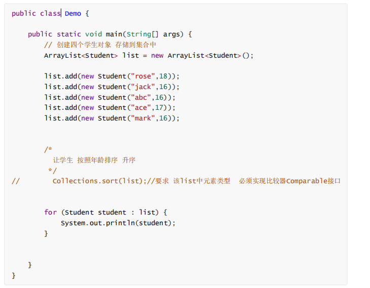
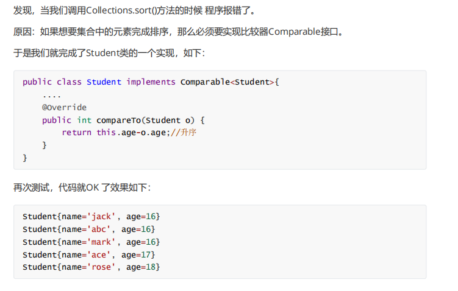

### 2.5 扩展
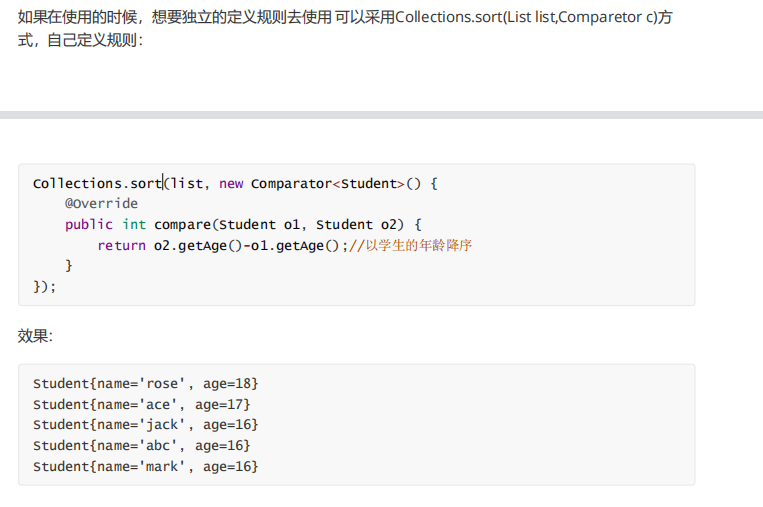
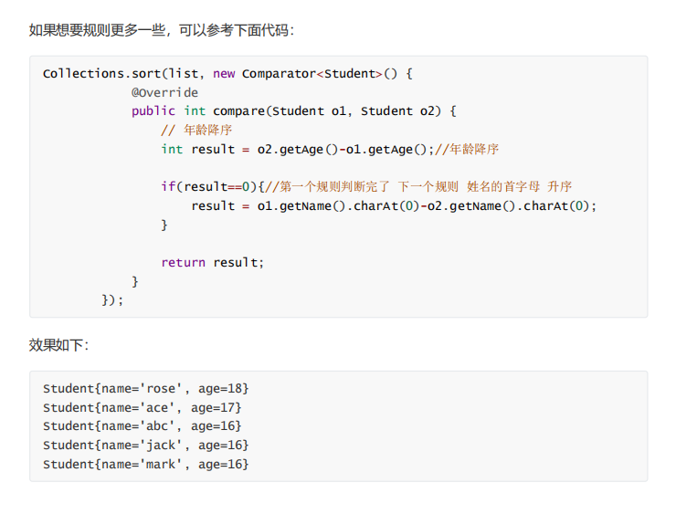
# Map 接口（重点）
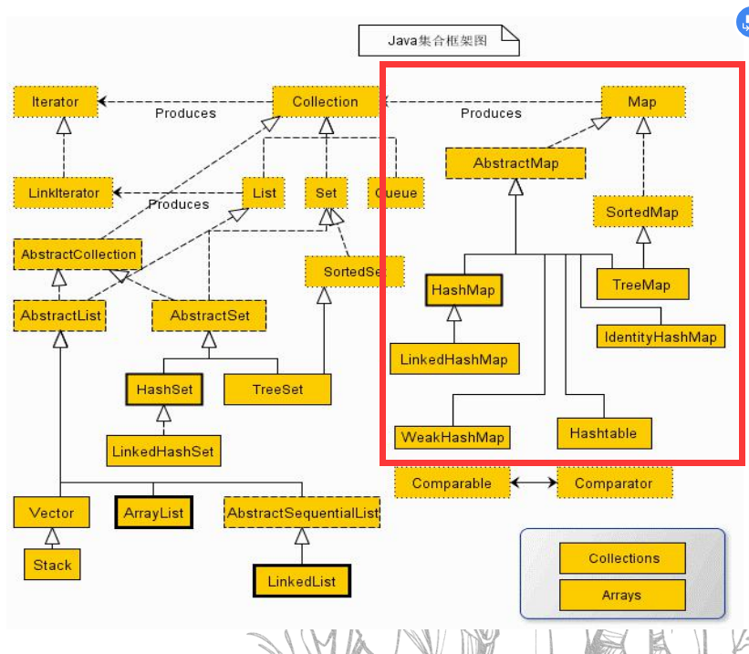
使用 Map 接口。里面的所有内容都按照 keyvalue 的形式保存，也称为二元偶对象。
此接口定义如下： `public interface Map<K,V>`
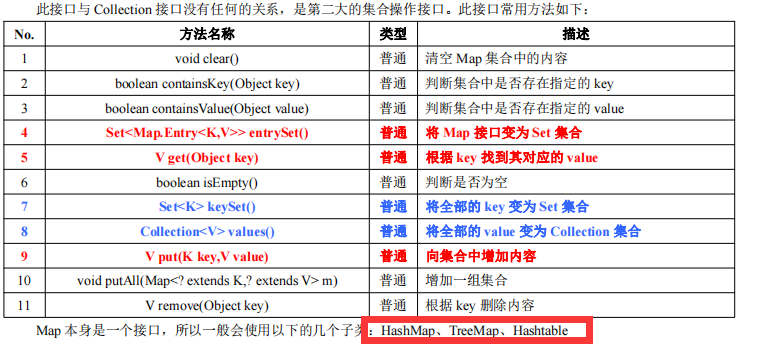

## 新的子类：HashMap（重点）
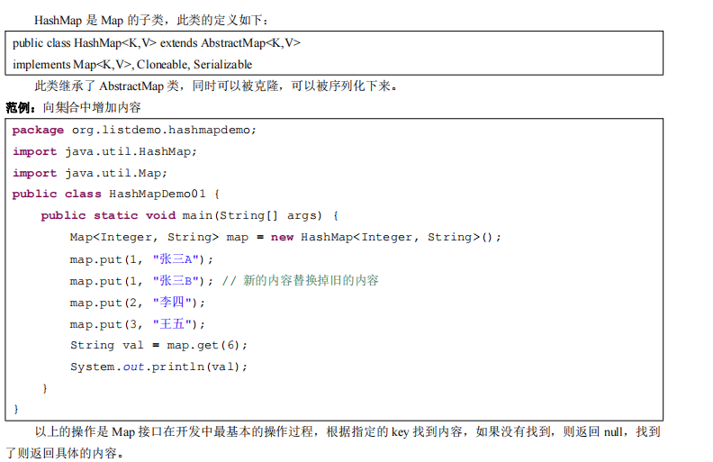

范例：得到全部的 key 或 value
```java
import java.util.*;

public class D09_Map {
    public static void main(String[] args) {
        Map<Integer, String> map = new HashMap<Integer, String>();
        map.put(1, "张三A");
        map.put(2, "李四");
        map.put(3, "王五");
        Set<Integer> set = map.keySet(); // 得到全部的key
        Collection<String> value = map.values(); // 得到全部的value
        Iterator<Integer> iter1 = set.iterator();
        Iterator<String> iter2 = value.iterator();
        System.out.print("全部的key：");
        while (iter1.hasNext()) {
            System.out.print(iter1.next() + "、");
        }
        System.out.print("\n全部的value：");
        while (iter2.hasNext()) {
            System.out.print(iter2.next() + "、");
        }
    }
}
```
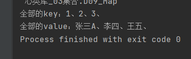
既然可以取得全部的 key，那么下面就可以对以上的操作进行扩充，循环输出 Map 中的全部内容
```java
import java.util.HashMap;
import java.util.Iterator;
import java.util.Map;
import java.util.Set;

public class D09_Map2 {
    public static void main(String[] args) {
        Map<String, String> map = new HashMap<String, String>();
        map.put("ZS", "张三");
        map.put("LS", "李四");
        map.put("WW", "王五");
        map.put("ZL", "赵六");
        map.put("SQ", "孙七");
        Set<String> set = map.keySet();// 得到全部的key
        Iterator<String> iter = set.iterator();
        while (iter.hasNext()) {
            String i = iter.next();
            // 得到key
            System.out.println(i + " --:> " + map.get(i));
        }
    }
}
```
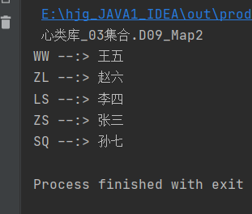


## 旧的子类：Hashtable（重点）
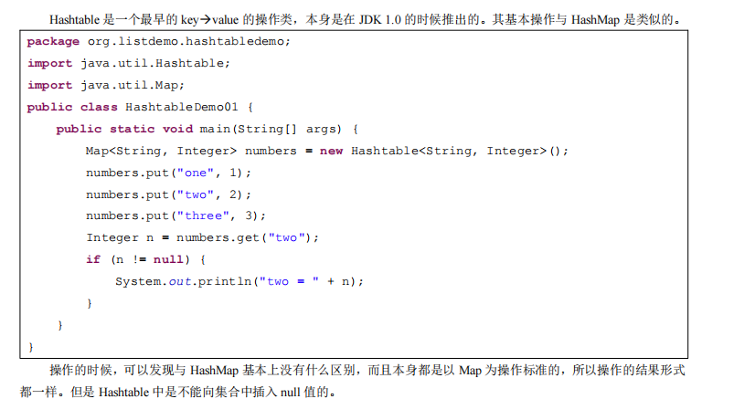

## HashMap 与 Hashtable 的区别（重点）
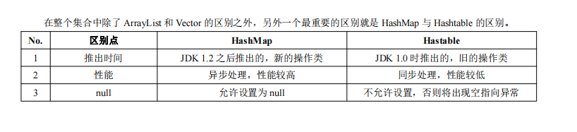
## 排序的子类：TreeMap（理解）
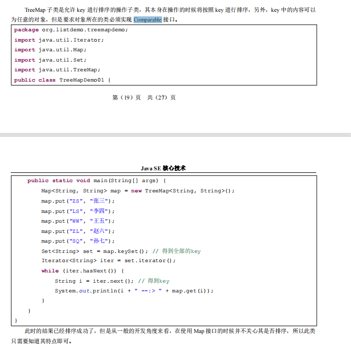
## 关于 Map 集合的输出
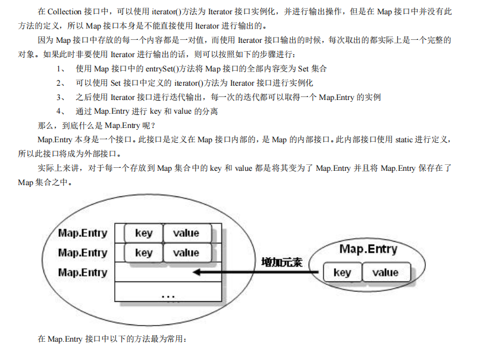
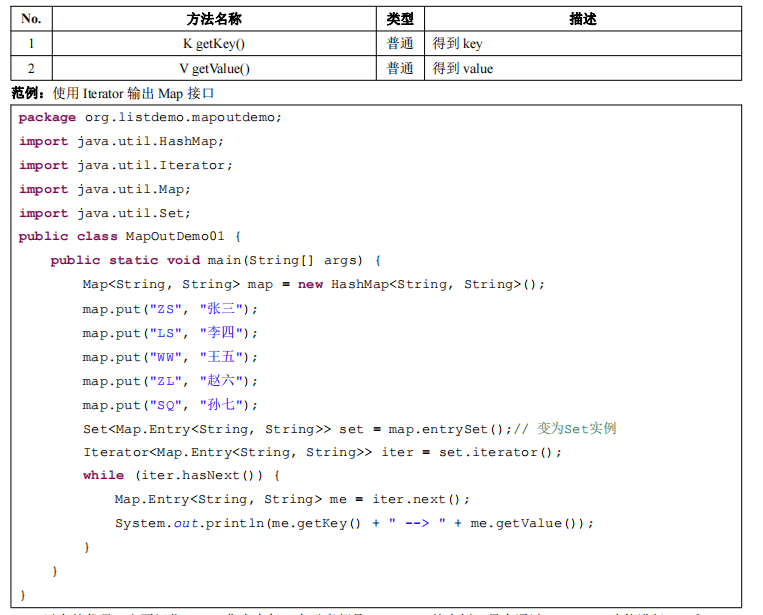
以上的代码一定要记住，Map 集合中每一个元素都是 Map.Entry 的实例，只有通过 Map.Entry 才能进行 key 和 value 的分离操作。 除了以上的做法之外，在 JDK 1.5 之后也可以使用 foreach 完成同样的输出，只是这样的操作基本上不使用。
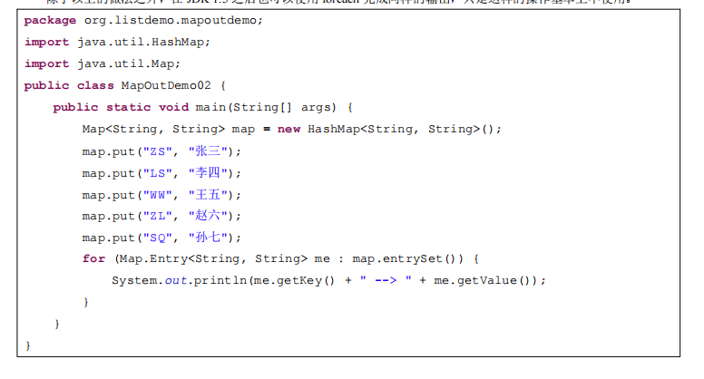

# 两种关系（理解）
使用类集，除了可以清楚的表示出动态数组的概念及各个数据结构的操作之外，也可以表示出以下的两种关系
## 1、第一种关系：一对多关系
一个学校有多个学生，是一个典型的一对多的关系。
范例：定义学生类，一个学生属于一个学校
```java
public class E0_Student {
    private String name;
    private int age;
    private E0_School school;

    public E0_School getSchool() {
        return school;
    }

    public void setSchool(E0_School school) {
        this.school = school;
    }

    public E0_Student(String name, int age) {
        this.name = name;
        this.age = age;
    }

    @Override
    public String toString() {
        return "学生信息" + "\n" + "\t|- 姓名：" + this.name + "\n" + "\t|- 年龄：" + this.age;
    }
}
```
范例：定义学校类，一个学校有多个学生

```java
import java.util.ArrayList;
import java.util.List;

public class E0_School {
    private String name;
    private List<E0_Student> allStudents = null;
    public E0_School(){
        this.allStudents = new ArrayList<E0_Student>();
    }

    public E0_School(String name) {
        this();
        this.name = name;
    }

    public List<E0_Student> getAllStudents() {
        return allStudents;
    }

    @Override
    public String toString() {
        return "学校信息：" + "\n" + "\t|- 学校名称：" + this.name;
    }
}
```
测试
```java
import java.util.Iterator;

public class E0_TestDemo {
    public static void main(String[] args) {
        E0_Student stu1 = new E0_Student("张三",10);
        E0_Student stu2 = new E0_Student("李四",11);
        E0_Student stu3 = new E0_Student("王五",13);

        E0_School sch = new E0_School("LAMP JAVA");
        sch.getAllStudents().add(stu1); // 一个学校有多个学生
        stu1.setSchool(sch);// 一个学生属于一个学校
        sch.getAllStudents().add(stu2); // 一个学校有多个学生
        stu2.setSchool(sch);// 一个学生属于一个学校
        sch.getAllStudents().add(stu2); // 一个学校有多个学生
        stu3.setSchool(sch);// 一个学生属于一个学校
        System.out.println(sch);
        Iterator<E0_Student> iter = sch.getAllStudents().iterator();
        while (iter.hasNext()){
            System.out.println(iter.next());
        }
        System.out.println(stu1.getSchool());
    }
}
```
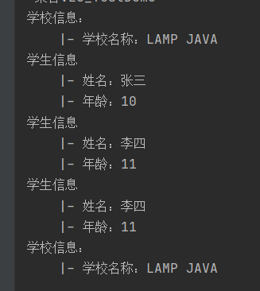

## 2、第二种关系：多对多关系
一个学生可以选择多门课程，一门课程允许有多个学生参加。 
范例：定义学生类，一个学生可以选择多门课程
```java
import java.util.ArrayList;
import java.util.List;

public class E1_Student {
    private String name;
    private int age;
    private List<E1_Course> allCourses;

    public E1_Student() {
        this.allCourses = new ArrayList<E1_Course>();
    }

    public E1_Student(String name, int age) {
        this();
        this.name = name;
        this.age = age;
    }
    public List<E1_Course> getAllCourses() {
        return allCourses;
    }

    @Override
    public String toString() {
        return "学生信息" + "\n" + "\t|- 姓名：" + this.name + "\n" + "\t|- 年龄：" + this.age;
    }
}
```
范例：定义课程类，一门课程可以有多个学生参加
```java
import java.util.ArrayList;
import java.util.List;

public class E1_Course {
    private String name;
    private int credit;
    private List<E1_Student> allStudents = null;

    public E1_Course() {
        this.allStudents = new ArrayList<E1_Student>();
    }


    public E1_Course(String name, int credit) {
        this();
        this.name = name;
        this.credit = credit;
    }

    public List<E1_Student> getAllStudents() {
        return allStudents;
    }

    @Override
    public String toString() {
        return "课程信息：" + "\n" + "\t|- 课程名称：" + this.name + "\n" + "\t|- 课程学分： " + this.credit;
    }
}
```
下面同样在主方法处设置关系，但是必须注意的是，这个时候设置的关系也应该是双向操作完成的。
```java
import java.util.Iterator;

public class E1_TestDemo {
    public static void main(String[] args) {
        E1_Student stu1 = new E1_Student("张三", 10);
        E1_Student stu2 = new E1_Student("李四", 11);
        E1_Student stu3 = new E1_Student("王五", 12);
        E1_Student stu4 = new E1_Student("赵六", 15);
        E1_Student stu5 = new E1_Student("孙七", 13);

        E1_Course c1 = new E1_Course("Oracle", 5);
        E1_Course c2 = new E1_Course("JavaSE基础课程", 10);

        c1.getAllStudents().add(stu1); // 参加第一门课程
        c1.getAllStudents().add(stu2); // 参加第一门课程
        stu1.getAllCourses().add(c1); // 学生选择课程
        stu2.getAllCourses().add(c1); // 学生选择课程

        c2.getAllStudents().add(stu1); // 参加第二门课程
        c2.getAllStudents().add(stu2); // 参加第二门课程
        c2.getAllStudents().add(stu3); // 参加第二门课程
        c2.getAllStudents().add(stu4); // 参加第二门课程
        c2.getAllStudents().add(stu5); // 参加第二门课程

        stu1.getAllCourses().add(c2); // 学生选择课程
        stu2.getAllCourses().add(c2); // 学生选择课程
        stu3.getAllCourses().add(c2); // 学生选择课程
        stu4.getAllCourses().add(c2); // 学生选择课程
        stu5.getAllCourses().add(c2); // 学生选择课程
        System.out.println(c2);
        Iterator<E1_Student> iter = c2.getAllStudents().iterator();
        while (iter.hasNext()) {
            System.out.println(iter.next());
        }
        System.out.println("----------------------------");
        System.out.println(stu1);
        Iterator<E1_Course> iters = stu1.getAllCourses().iterator() ;
        while (iters.hasNext()) {
            System.out.println(iters.next());
        }
    }
}
```
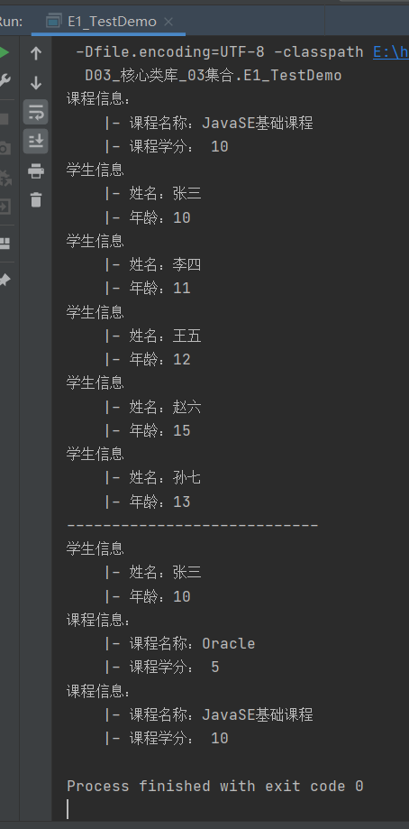
# 分析 equals、hashCode 与内存泄露（理解）
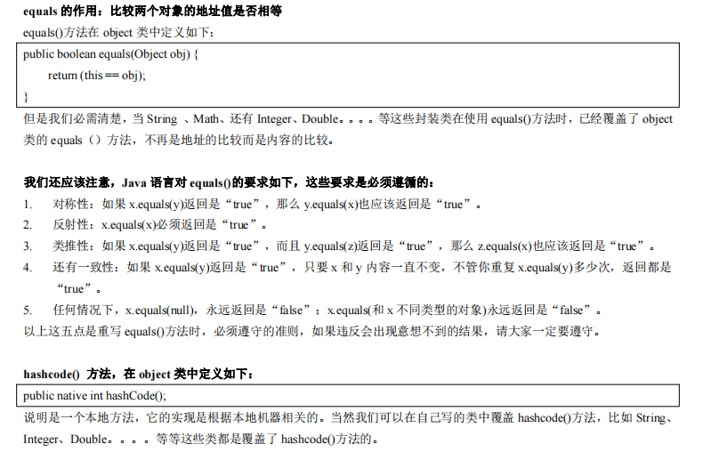
java.lnag.Object 中对 hashCode 的约定（很重要）： 
1. 在一个应用程序执行期间，如果一个对象的 equals 方法做比较所用到的信息没有被修改的话，则对该对象调用 hashCode 方法多次，它必须始终如一地返回同一个整数。
2. 如果两个对象根据 equals(Object o)方法是相等的，则调用这两个对象中任一对象的 hashCode 方法必须产生相同的整 数结果。
3. 如果两个对象根据 equals(Object o)方法是不相等的，则调用这两个对象中任一个对象的 hashCode 方法，不要求产生 不同的整数结果。但如果能不同，则可能提高散列表的性能。

# 4、总结
1、 类集就是一个动态的对象数组，可以向集合中加入任意多的内容。 
2、 List 接口中是允许有重复元素的，Set 接口中是不允许有重复元素。 
3、 所有的重复元素依靠 hashCode()和 equals 进行区分 
4、 List 接口的常用子类：ArrayList、Vector 
5、 Set 接口的常用子类：HashSet、TreeSet 
6、 TreeSet 是可以排序，一个类的对象依靠 Comparable 接口排序 
7、 Map 接口中允许存放一对内容，key  value 
8、 Map 接口的子类：HashMap、Hashtable、TreeMap 
9、 Map 使用 Iterator 输出的详细步骤


